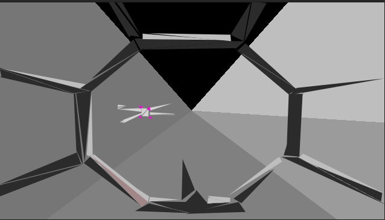

# iocc-death-star

This is an obfuscated C, triangle renderer. It renders a scene from Star Wars and spits out a tga image.

**Output**

I started by taking an image from the movie, and then drawing each triangle in photoshop. I kept track of the triangle coordinates and used those in my program.

**Triangle Plan**

**Movie**

My obfuscation idea was centered around overloading all the symbols, using separate namespaces for structs, enums, etc.

I had the idea after learning about [iocc](http://ioccc.org). If I remember correctly,
my program is pretty close to the specifications, but I never finished or submitted it.

## Project Licence

MIT License

Copyright (c) 2018 Justin Meiners

Permission is hereby granted, free of charge, to any person obtaining a copy of this software and associated documentation files (the "Software"), to deal in the Software without restriction, including without limitation the rights to use, copy, modify, merge, publish, distribute, sublicense, and/or sell copies of the Software, and to permit persons to whom the Software is furnished to do so, subject to the following conditions:

The above copyright notice and this permission notice shall be included in all copies or substantial portions of the Software.

THE SOFTWARE IS PROVIDED "AS IS", WITHOUT WARRANTY OF ANY KIND, EXPRESS OR IMPLIED, INCLUDING BUT NOT LIMITED TO THE WARRANTIES OF MERCHANTABILITY, FITNESS FOR A PARTICULAR PURPOSE AND NONINFRINGEMENT. IN NO EVENT SHALL THE AUTHORS OR COPYRIGHT HOLDERS BE LIABLE FOR ANY CLAIM, DAMAGES OR OTHER LIABILITY, WHETHER IN AN ACTION OF CONTRACT, TORT OR OTHERWISE, ARISING FROM, OUT OF OR IN CONNECTION WITH THE SOFTWARE OR THE USE OR OTHER DEALINGS IN THE SOFTWARE.

